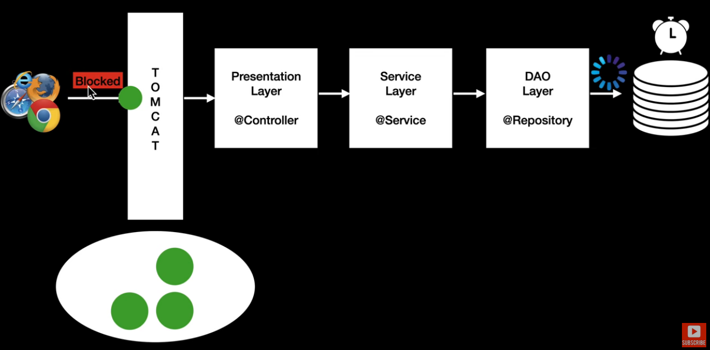
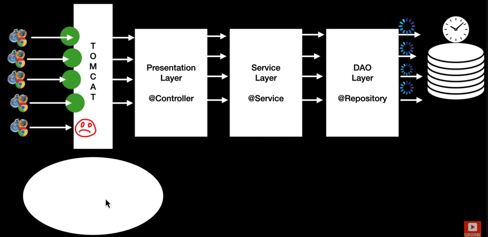

In Springboot, presentation layer contains controller and we can build endpoints.
service layer contains business logic
DAO layer contains database related operations and interacts with database.

To deploy the code implemented by above layers in built server is tomcat and when
it receives the request. 

The tomcat server contains thread pool(contains number of threads) which helps
to process server requests.

When a server request comes, a server thread assigned to this request. So, in synchronous
programming until the response not comes from database, no other request assigned
or performed. So, this is blocked and this is thread per-request model.

Default threads inside a thread pool of a tomcat server is 200

