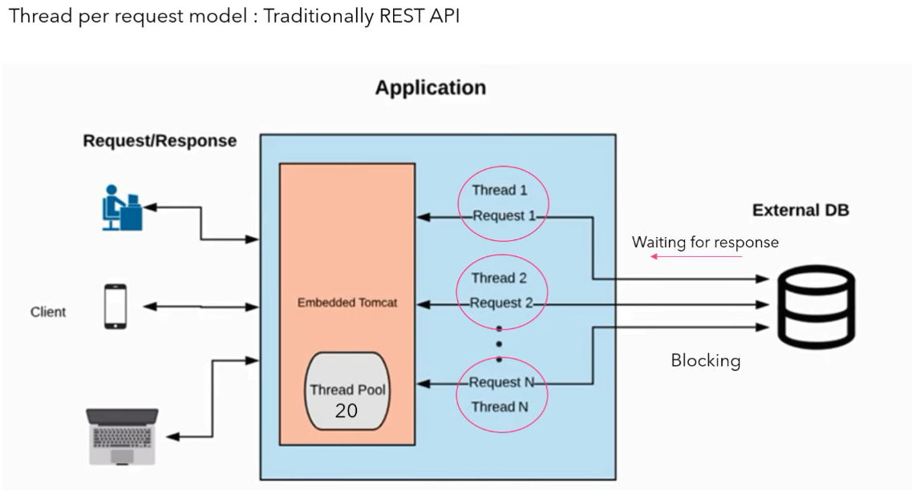

Traditional Rest API works with thread per-request model. 

different users lets say from web or mobile requests send to client application.
Here each request serve or process by separate thread.

Here, request1 assigned to thread 1. Now thread 1 request go to DB and try to fetch 
data from DB.

Here until thread1 get response from DB, thread1 is application is totally block.

Let's say in this scenario, the thread pool limit is 20 means 20 concurrent request
at a time.

If request comes beyond 20 request, then request needs to be wait until any existing
thread is free. because all my thread is blocked by database driver to get the response.

which completely gives poor performance as it is synchronous and blocking flow.

Because all the threads occupied by database driver to get the response.

for this reason 21 number request couldn't handle by any of the thread. To overcome this problem Spring
reactive or Web flux came.

Spring reactive eliminates thread per request concept.