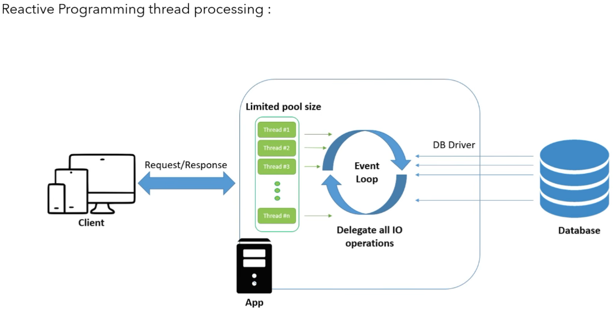

In reactive programming, request came to application and assigned to thread1
and now thread1 go to database and fetching data. Here thread1 not wait to get the
response back. 

Instead, thread sends an event to database and inform to database that I(thread)
not wait anymore to get the response. You execute your job and ready with response,
assign the response with any other available thread and publish me a complete event.

Now, in this case thread1 is completely free and easily accepts N number of requests.

because not a single thread is blocking in this Event Loop approach.

With this approach, we can handle tons of concurrent request with very less thread.

