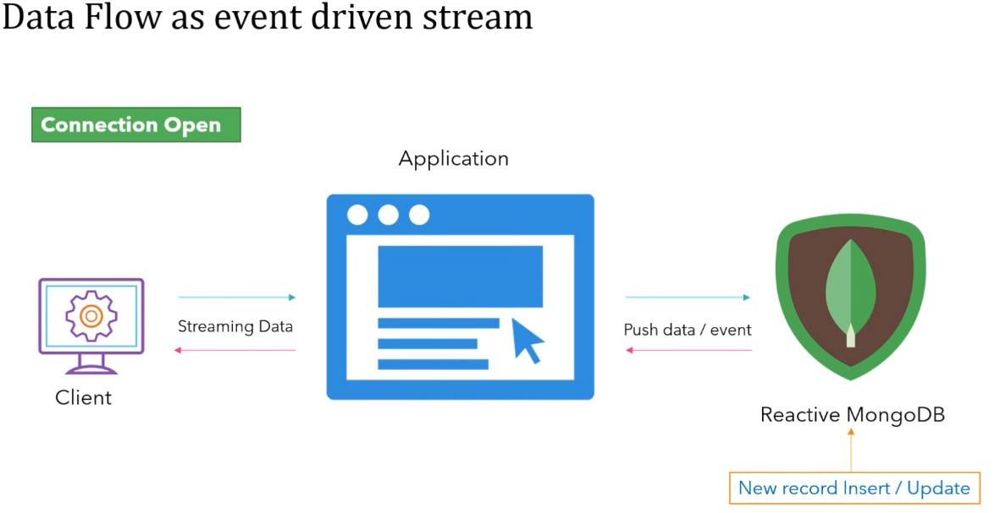

If any modification or insertion of few records in middle/during operations, spring 
web can't handle this scenario.

To overcome this scenario, spring reactive web is being used.

if there is any change in database, then immediately it will fire or publish an event
to inform the new data found.

Now whoever subscribe, they can stream the data.

In the above snapshot, client is a subscriber and database is a publisher.

If any changes happen to a database, then it publish an event as client is able to 
access the application. Client can easily stream the data.

In this scenario, the connection is open state and for this reason we can use publisher
subscriber operation.

For example: the best scenario is Cricket Live Score

Any update in application, we can see the current score with updated details.

So, this is how the data is transferred as an event on the publisher ans subscriber model and
this mechanism called as dataflow as event driven stream which is supported by
spring reactive programming.

