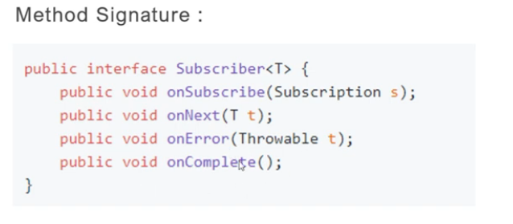
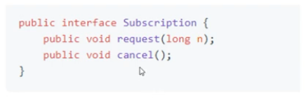
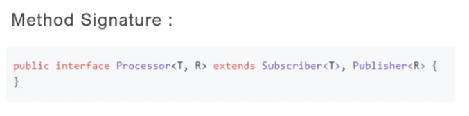

Specification/Rules:

we need to follow certain rules or specification to achieve spring reactive programming.
specifications are it should have
1. Publisher/Producer - publish an event (Database driver)
2. Subscriber - subscribe to event (Backend app/Browser)
3. Subscription
4. Processor

Publisher/Producer: Publisher is a datasource who will always publish an event.

It is an interface contains only one method subscribe which helps to subscribe into publisher.

Subscriber or Consumer:

Subscriber will subscribe/consume the events from publisher.

Subscription:

Subscription represents the unique relationship between a Subscriber and a Publisher.

Processor:

A processor represents a processing stage - which is a Subscriber and a Publisher and must obey the
contracts of both.

