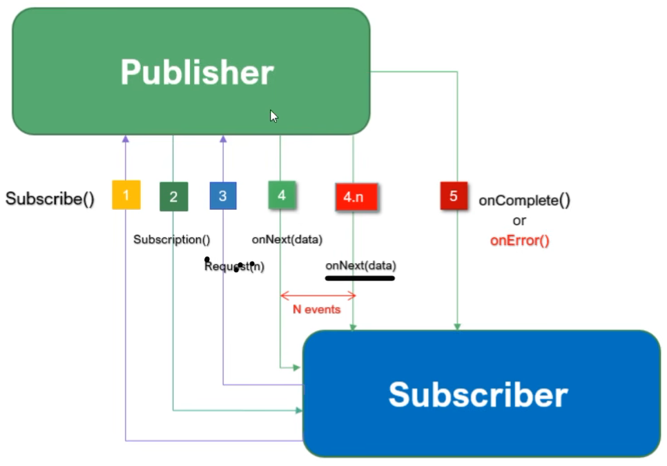

1. Subscriber interface invoke subscribe() of Publisher and pass the subscriber instance as a input.
2. Next step Publisher sends an Subscription() event to Subscriber and confirming that successful subscription information to Subscriber.
3. After that Subscriber call a request(n) from Subscription interface to get the data from Publisher. Here request(n) means
subscriber can request n number of data from publisher
4. Next Publisher will send data stream to Subscriber by invoking onNext(data)

Let's assume Publisher returns 10 records. So, in this case Publisher will fire 10 times onNext(10) event.
If publisher send n number of data, then there will be N times on onNext(N) event.

Once all the records received by subscriber, then Publisher invokes a onComplete() of Subscriber to confirm the job done by Publisher
if the execution is successful.

If there is any error, Publisher will fire onError() event

Also there is an option for Subscriber to get/ask limited number of data from Publisher.

Let's say Publisher has 10 item, if we want to fetch only two item, then Subscriber can control that. means request(2)

Reactive Programming Library:

1. Reactor
2. RxJava
3. JDK9 Flow Reactive Stream

Reactor-Core, Reactor-Test, Reactor-Extra, Reactor-Netty, Reactor-Adapter and Reactor-Kafka etc available in Spring Reactor and all 
supported by spring boot framework.

In Project Reactor, there are two data types 1. Flux and 2. Mono

