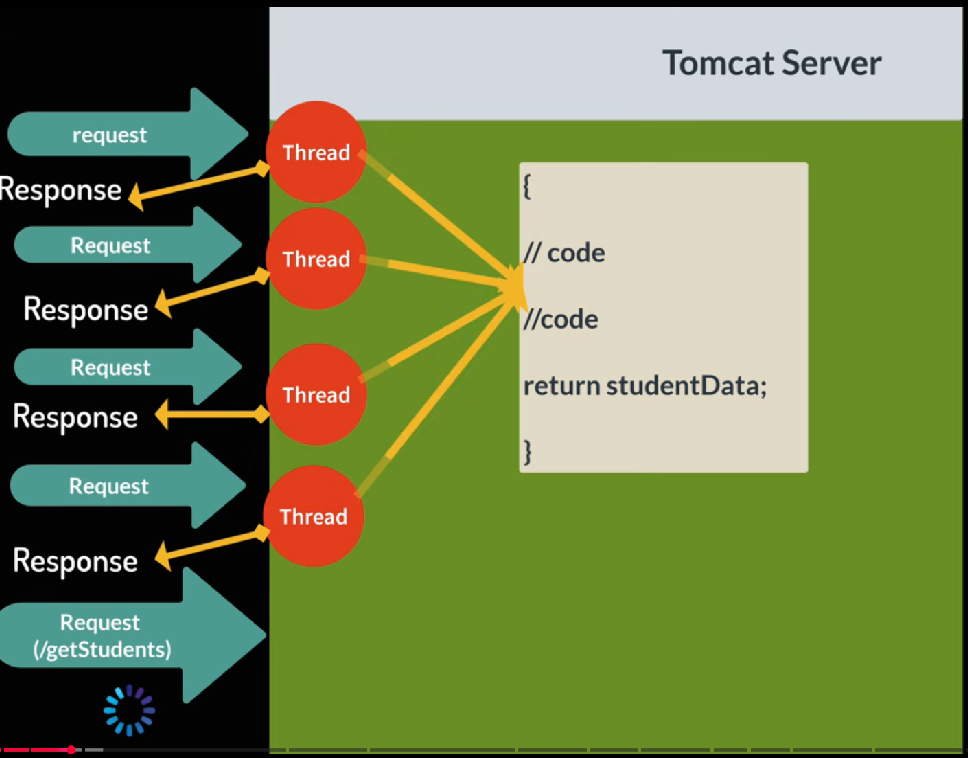
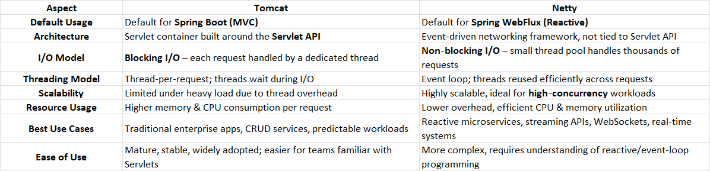

The difference between Tomcat & Netty in case of spring reactive or asynchronous programming.

Tomcat is a traditional servlet container using a thread‑per‑request model, 
while Netty is an asynchronous, event‑driven framework optimized for non‑blocking I/O. In Spring Reactive (WebFlux), Netty is the default choice because it scales better under high concurrency,
whereas Tomcat can still be used but is less efficient for reactive workloads.

🔍 Practical Implications
Tomcat with WebFlux

Still possible, but WebFlux runs on Tomcat’s NIO connector.

Each request ties up a thread until completion, reducing efficiency.

Better suited if your team already relies heavily on Servlet‑based infrastructure.

Netty with WebFlux

Designed for reactive programming; integrates seamlessly with Mono/Flux types.

Handles thousands of concurrent connections with fewer threads.

Ideal for microservices, real‑time APIs, and streaming workloads.

🚨 Trade‑offs & Risks
Tomcat: Easier onboarding, but scaling requires more hardware; thread contention can cause latency spikes under load.

Netty: More efficient, but debugging asynchronous flows and managing backpressure can be challenging; requires stronger developer expertise.

✅ Decision Guide
Choose Tomcat if:

You’re building traditional Spring Boot MVC apps.

Your workload is moderate and predictable.

Your team is more comfortable with the Servlet model.

Choose Netty if:

You expect high concurrency (thousands of requests/sec).

You need real‑time responsiveness (e.g., WebSockets, streaming).

You’re building reactive microservices with Spring WebFlux.